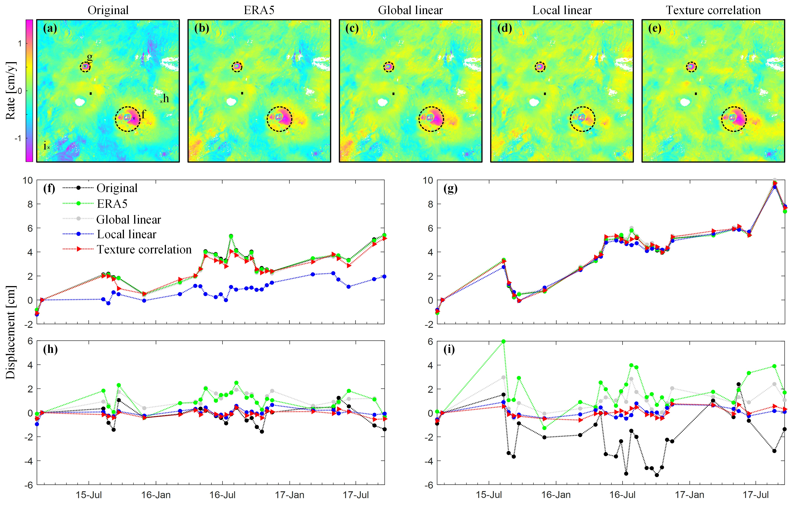

## Code and Jupyte Notebooks for:

+ Yang, Q., Yunjun, Z., Wang, R. Y. Heterogeneous InSAR Tropospheric Correction Based on Local Texture Correlation, _IEEE Transactions on Geoscience and Remote Sensing, 62_, doi:[10.1109/TGRS.2024.3356749](https://doi.org/10.1109/TGRS.2024.3356749).

  
   Fig. 8 Comparison of deformation rate and time series before and after tropospheric corrections. Dataset: ALOS-2 descending track 23 over Kirishima volcanoes, Kyushu, Japan.

